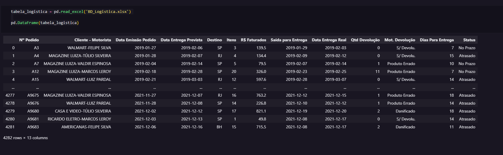
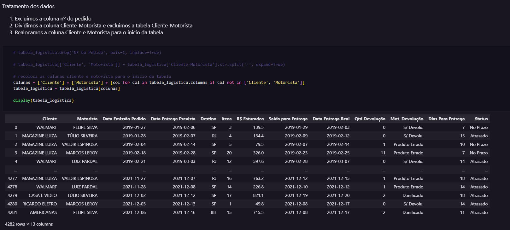
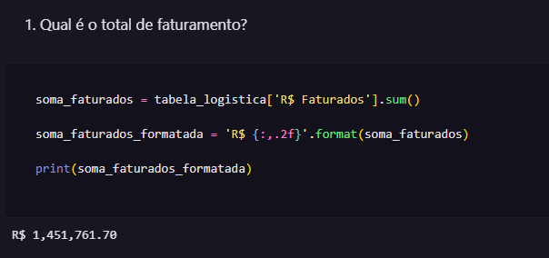
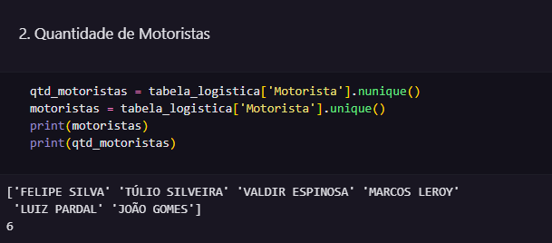
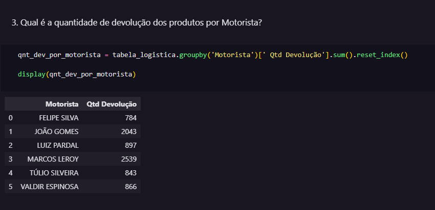
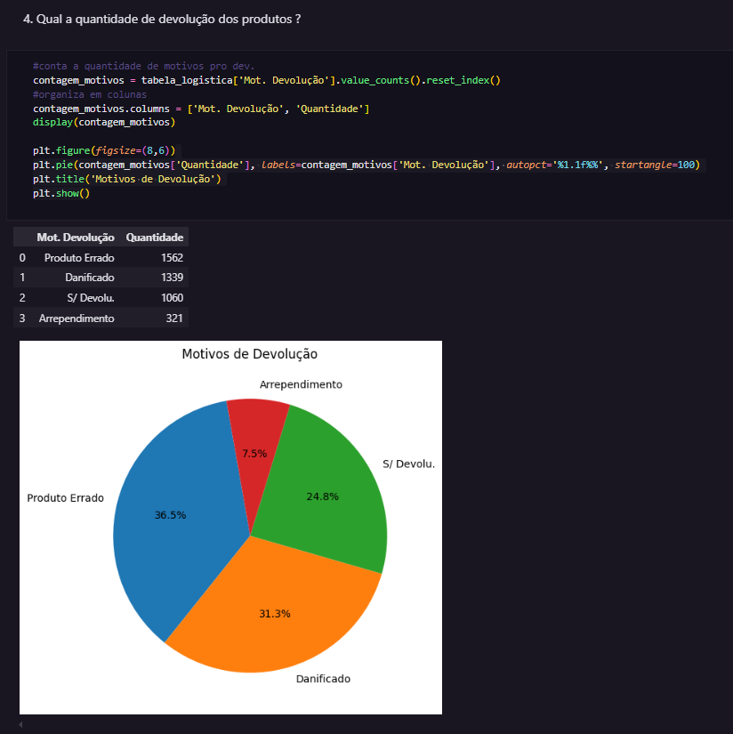
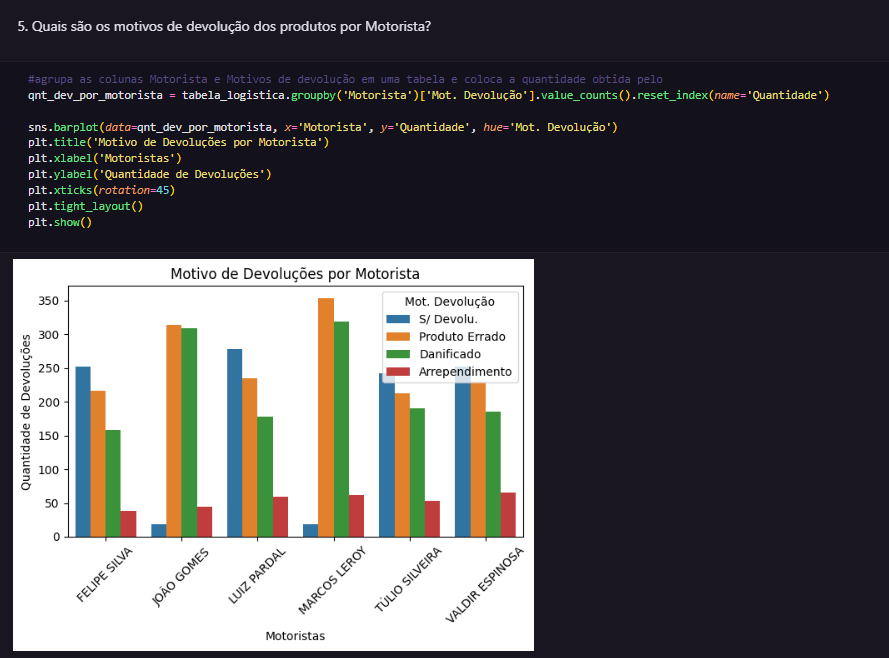
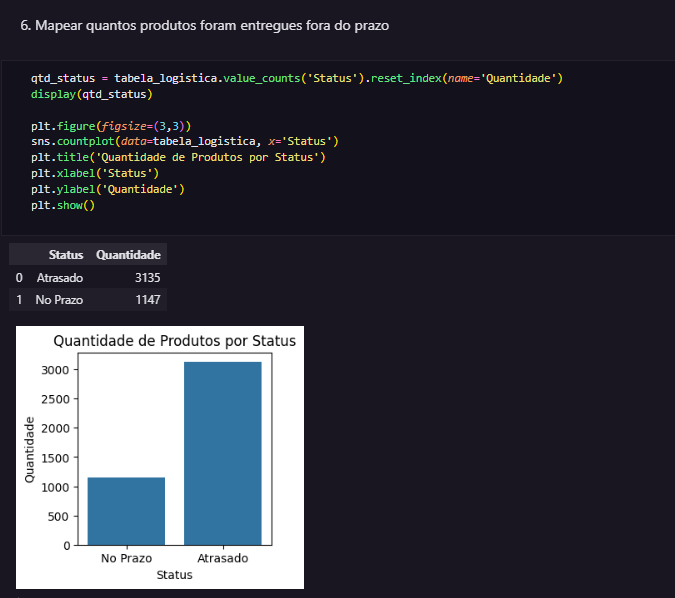
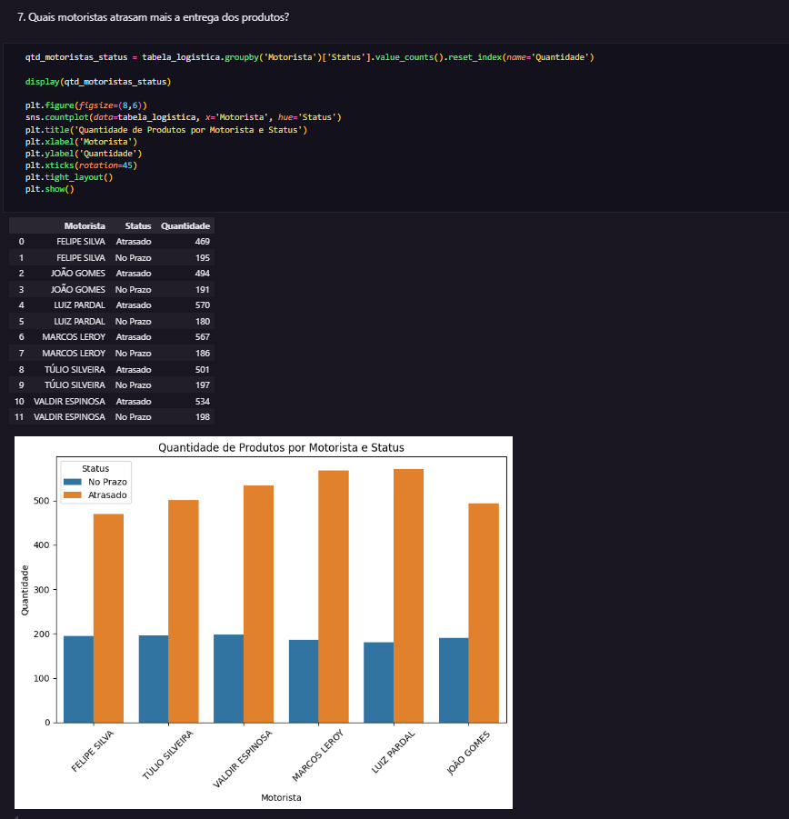

# Análise de Dados para Logística: Insights sobre Entregas e Motoristas 🚚

Este projeto utiliza **Python** no Google Colab para analisar dados de entregas de uma empresa de logística, identificando problemas operacionais e propondo soluções baseadas em dados.

## 📌 Objetivo

Auxiliar a empresa a:

- Identificar padrões de atrasos e devoluções.
- Otimizar a alocação de motoristas.
- Reduzir custos operacionais através de insights estratégicos.

## 🗃️ Base de Dados

- **Formato**: CSV (dados anonimizados).
- **Variáveis**: Status de entrega, motivo de devolução, motorista responsável, localidade, faturamento, entre outros.

## 🔍 Análise Exploratória (EDA)

### 1. Carregamento e Tratamento dos Dados

_Carregamento inicial e verificação da qualidade dos dados._

### 2. Principais Métricas

|  |  |
| -------------------------------- | ----------------------------- |
| **Faturamento Total**            | **Motoristas Ativos**         |

### 3. Insights Chave

- **Devoluções por Motorista**:  
  
- **Motivos de Devolução**:  
  
  
- **Entregas Atrasadas**:
  
  

## 🛠️ Tecnologias Utilizadas

- **Google Colab**: Ambiente de execução.
- **Python 3.8+**: Linguagem principal.
- **Pandas**: Manipulação de dados.
- **Matplotlib/Seaborn**: Visualização de dados.

## ▶️ Como Executar o Projeto

1. **Acesse o Notebook**:

   - [Abrir no Google Colab](https://colab.research.google.com/drive/1Q5VppeAhTqz1sqq732usRLHuRdTlovV2)

2. **Executar as Células**:

   - Clique em "Runtime" > "Run all" para rodar o código do notebook.
   - Ou você pode rodar as células uma por uma clicando em cada célula e pressionando Shift + Enter.

3. **Verifique os Resultados**:
   - Gráficos serão exibidos após cada célula de visualização.
   - Dados processados são mostrados em tabelas dinâmicas.

## 🤝 Contribuindo

Contribuições são bem-vindas!
Sinta-se à vontade para contribuir com melhorias, correções ou novas funcionalidades.Para isso, por favor:

- Faça um fork do repositório
- Crie uma branch para a sua modificação (git checkout -b nova-funcionalidade)
- Commit suas alterações (git commit -am 'Adicionando nova funcionalidade')
- Envie para o repositório original (git push origin nova-funcionalidade)
- Abra um pull request
